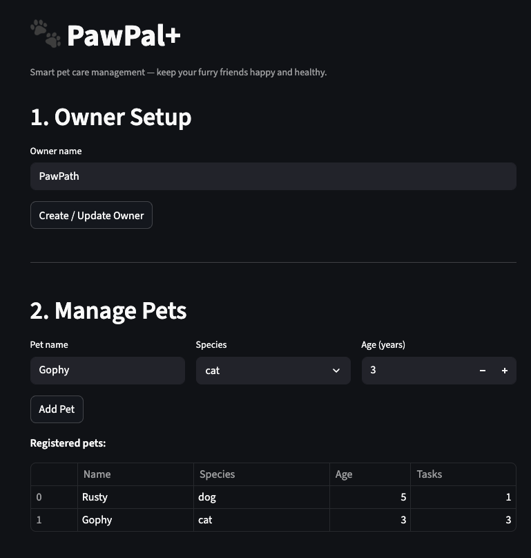
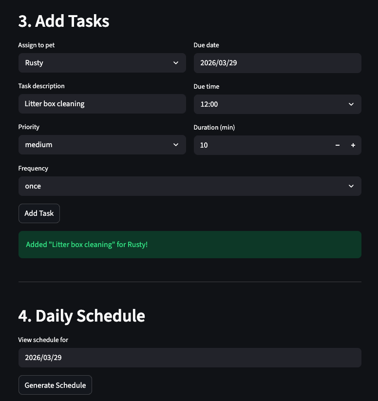
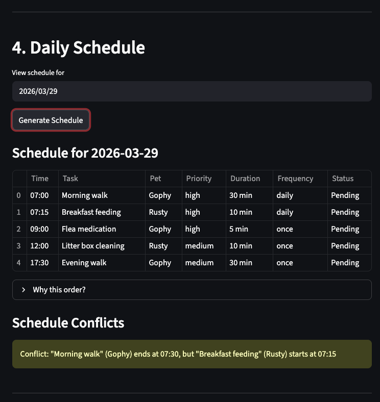
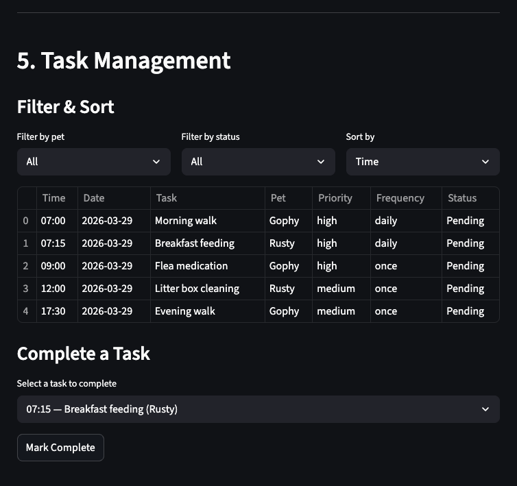
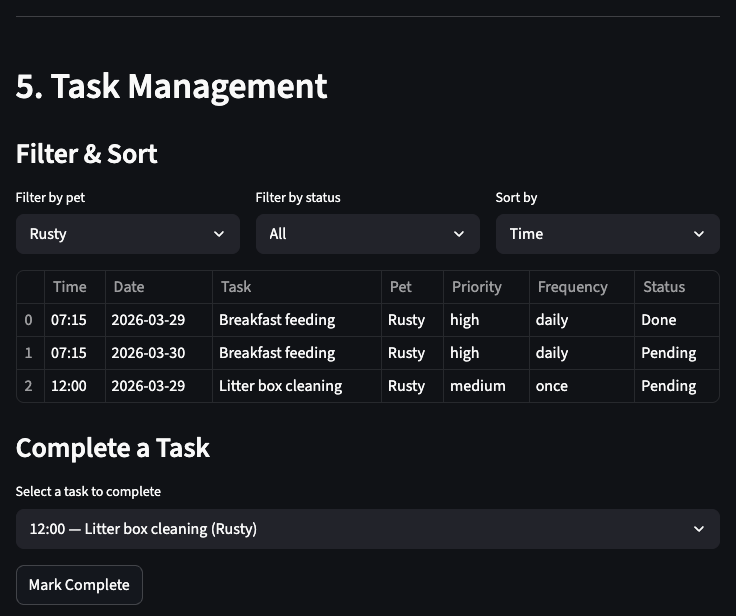
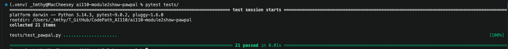
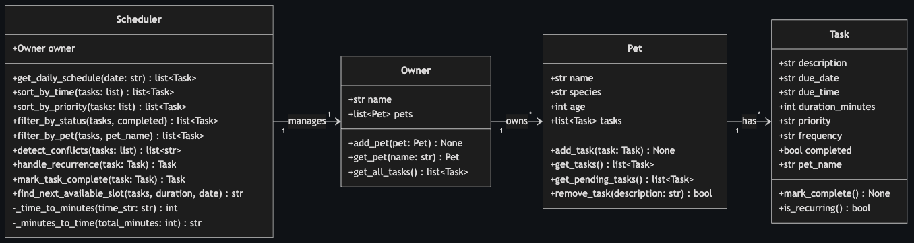
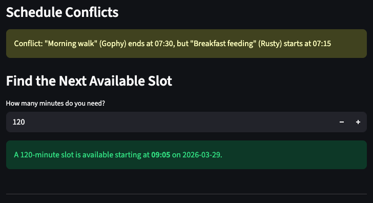

# PawPal+ (Module 2 Project)

You are building **PawPal+**, a Streamlit app that helps a pet owner plan care tasks for their pet.

## Scenario

A busy pet owner needs help staying consistent with pet care. They want an assistant that can:

- Track pet care tasks (walks, feeding, meds, enrichment, grooming, etc.)
- Consider constraints (time available, priority, owner preferences)
- Produce a daily plan and explain why it chose that plan

Your job is to design the system first (UML), then implement the logic in Python, then connect it to the Streamlit UI.

## What you will build

Your final app should:

- Let a user enter basic owner + pet info
- Let a user add/edit tasks (duration + priority at minimum)
- Generate a daily schedule/plan based on constraints and priorities
- Display the plan clearly (and ideally explain the reasoning)
- Include tests for the most important scheduling behaviors

## Getting started

### Setup

```bash
python -m venv .venv
source .venv/bin/activate  # Windows: .venv\Scripts\activate
pip install -r requirements.txt
```

### Suggested workflow

1. Read the scenario carefully and identify requirements and edge cases.
2. Draft a UML diagram (classes, attributes, methods, relationships).
3. Convert UML into Python class stubs (no logic yet).
4. Implement scheduling logic in small increments.
5. Add tests to verify key behaviors.
6. Connect your logic to the Streamlit UI in `app.py`.
7. Refine UML so it matches what you actually built.

---

## System Overview

The backend lives in `pawpal_system.py` and is built with four core classes:

| Class | Role |
|-------|------|
| **Task** | A single care activity with a description, date, time, duration, priority, frequency, and completion status. |
| **Pet** | A pet profile (name, species, age) that holds a list of its own tasks. |
| **Owner** | Represents the owner. Manages one or more pets and can collect all tasks across them. |
| **Scheduler** | The "brain." Sorts, filters, detects conflicts, and handles recurring tasks across all of the owner's pets. |

See [`uml_diagram.md`](uml_diagram.md) for the full Mermaid.js class diagram showing attributes, methods, and relationships.

## Features

### Smarter Scheduling

PawPal+ goes beyond simple task lists with three algorithmic features built into the Scheduler:

1. **Sorting by time and priority** — Tasks are sorted chronologically (earliest first) using Python's `sorted()` with a lambda key on the `"HH:MM"` time string. A separate method sorts by priority level (high > medium > low) using a mapping dictionary.

2. **Conflict detection** — The scheduler walks through time-sorted tasks and compares each task's end time (start + duration) against the next task's start time. If they overlap, it returns a clear warning message instead of crashing. This works across different pets, so the owner sees all conflicts in one place.

3. **Recurring task management** — When a daily or weekly task is marked complete, the scheduler automatically creates a new task for the next occurrence using Python's `timedelta`. Daily tasks get +1 day, weekly tasks get +7 days. The new task is added to the correct pet with `completed = False`.

### Filtering

Tasks can be filtered by:
- **Pet name** — see only one pet's tasks
- **Completion status** — show only pending or only done tasks

### Streamlit UI

The web interface (`app.py`) connects directly to the backend classes:
- Create an owner and register pets
- Add tasks with date/time pickers, priority, duration, and frequency
- Generate a daily schedule (sorted, with conflict warnings)
- Find the next available open slot for a new task
- Filter and sort tasks interactively
- Mark tasks complete (with automatic recurrence handling)

## Run the CLI Demo

```bash
python main.py
```

This creates sample data (1 owner, 2 pets, 5 tasks) and prints a formatted daily schedule with conflict detection and recurrence handling.

## Run the Streamlit App

```bash
streamlit run app.py
```

## Testing PawPal+

Run the full test suite with:

```bash
pytest tests/ -v
```

**What the tests cover (21 tests):**

- **Core classes** — task completion, recurring flag, task count on add, pet_name auto-stamping, pending filter, cross-pet task aggregation
- **Sorting** — chronological order by time, priority ranking (high first)
- **Recurrence** — daily (+1 day), weekly (+7 days), one-time (no new task created)
- **Conflict detection** — overlapping tasks flagged, non-overlapping tasks clean
- **Next available slot** — morning gap, between-task gap, after-last-task gap, fully packed day, empty day
- **Edge cases** — empty task lists, pets with no tasks, empty conflict checks

**Confidence Level:** 4/5 stars. The core scheduling logic, sorting, recurrence, and conflict detection are all tested with both happy paths and edge cases. The one area that could use more coverage is the Streamlit UI integration (session state behavior), which is harder to unit test.

---

## 📸 Demo

Screenshots of PawPal+ in action.

  

  

  

  

  

Screenshot of tests all passing.

  

Final UML diagram (also see [`uml_diagram.md`](uml_diagram.md) for the full Mermaid.js class diagram).

  

## 🚀 Stretch Features

Challenge 1: Advanced Algorithmic Capability via Agent Mode

  

### Advanced: Next Available Slot Finder

Beyond the basic requirements, PawPal+ includes a "next available slot" algorithm. Given the existing tasks on a day and a desired duration, it scans the schedulable window (06:00–22:00) for the first gap large enough to fit the new activity. It works by building a list of "busy blocks" from sorted tasks, then walking through the timeline to find open space. If no gap is large enough, it returns `None` and the UI shows a helpful message.

**How AI Agent Mode was used:** The slot-finding logic was implemented using Claude Code's agent mode. The prompt described the desired behavior (scan a day's schedule, find gaps, return earliest fit), and the agent generated the algorithm using the Scheduler's existing `_time_to_minutes` helper methods. The initial implementation was verified through five targeted test cases (morning gap, between-task gap, after-last-task gap, fully packed day, and empty day) before being wired into the Streamlit UI.
