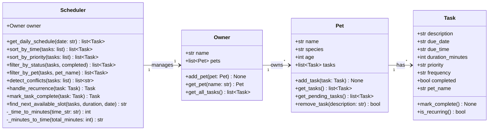

# PawPal+ UML Class Diagram

## Relationships
- **Owner** owns one or more **Pets** (one-to-many)
- **Pet** has zero or more **Tasks** (one-to-many)
- **Scheduler** manages one **Owner** and operates across all their pets' tasks

## Changes from Initial Design
- Added `mark_task_complete()` to Scheduler — a convenience method that marks a task done and automatically handles recurrence in one step.
- Added private helper methods `_time_to_minutes()` and `_minutes_to_time()` to Scheduler — used internally by conflict detection and the upcoming next-available-slot feature.
